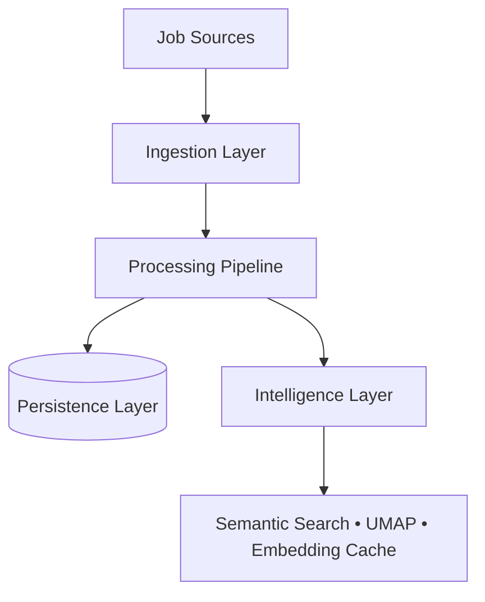

# JobPulse AI

JobPulse AI is an extensible intelligence platform capable of transforming raw job postings into structured, searchable, and analyzable knowledge. 

Rather than a simple web scraper, this project serves as a comprehensive **AI Systems Engineering Case Study**, demonstrating strict architectural boundaries, reproducible NLP pipelines, and deterministically versioned datasets.

👉 **[Read the Full Engineering Case Study here](docs/architecture/case_study.md)**

---

## 🛠️ System Architecture

JobPulse AI utilizes a strict clean architecture separating Ingestion, Processing, Analytics, and Semantic Intelligence. 



## 🚀 Quick Start

1. **Install dependencies:**
   ```bash
   uv venv
   uv pip install -r pyproject.toml
   ```
2. **Run semantic embeddings and visualization:**
   ```bash
   python demo_embedding_analytics.py
   ```
   *(Generates PCA and UMAP artifacts into `artifacts/visualization/`)*

## 🧠 Semantic Intelligence
JobPulse AI converts scraped job descriptions into local dense 384-dimensional vectors. Utilizing dimensionality reduction (UMAP), we can instantly cluster and visualize the modern job market without relying on external cloud APIs.


## 📊 Analytics
JobPulse AI provides typed analytics over the data, tracking skills, remote work, and normalized salaries into flattened `.csv` and `.parquet` formats for seamless integration with downstream ML workflows.

---
**License**: MIT  
**Read More**: [Building JobPulse AI (Case Study)](docs/architecture/case_study.md)
