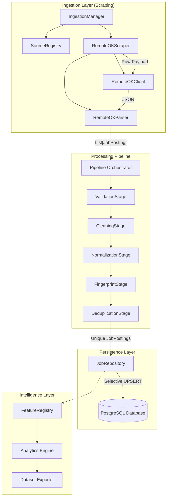
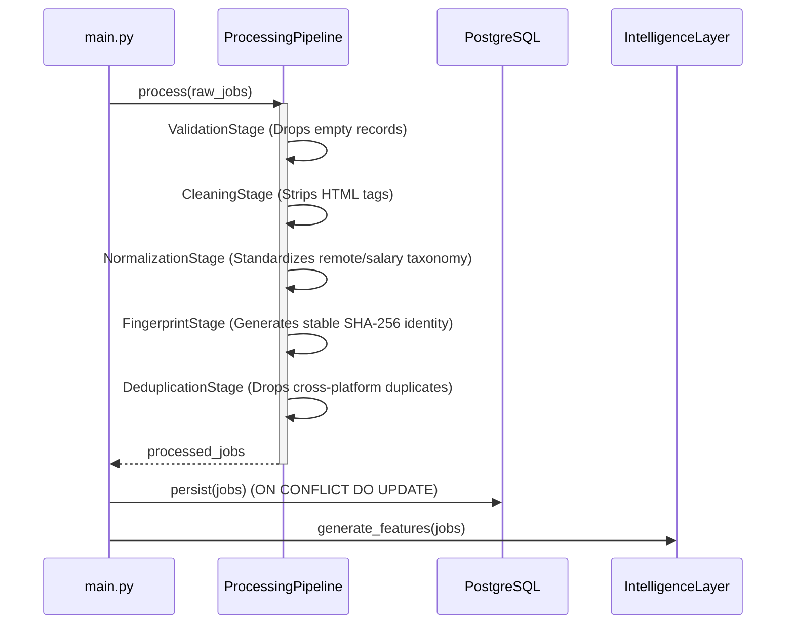

# JobPulse AI 🚀


> **JobPulse AI** is an end-to-end data platform that aggregates, cleans, processes, and analyzes software engineering job postings to uncover deep labor market intelligence and technical hiring trends.

## 📖 Overview

Most job scrapers are simple Python scripts. JobPulse AI is designed as a production-grade data engineering platform. It ingests semi-structured HTTP payloads, passes them through a deterministic data-cleaning pipeline, engineers Machine Learning features, and exports immutable Parquet datasets for advanced analytics.

By strictly separating concerns across **Ingestion**, **Processing**, **Persistence**, and **Intelligence**, the platform easily scales to new data sources and complex analytical capabilities.

---

## 🏗️ System Architecture



---

## ⚙️ Processing Pipeline

The core of the platform is the deterministic processing pipeline. Every scraped job is pushed through isolated stages:



---

## ✨ Features

- **Extensible Registry Pattern**: Adding a new scraping source requires zero modifications to the core orchestrator. Just register the scraper!
- **Selective UPSERTs**: The PostgreSQL repository intelligently updates volatile metadata (like `last_seen_at`) while protecting enriched platform fields (like `skills`).
- **Data Lineage**: Every single domain entity is bundled with strict `RecordMetadata` (source, pipeline version, timestamp, SHA-256 fingerprint).
- **Automated Feature Engineering**: Uses Namespaced extractors (e.g., `salary.mean`, `description.word_count`) to dynamically assemble flattened ML-ready `FeatureVectors`.
- **Immutable Export Manifests**: Serializes output datasets into `.parquet`, `.csv`, and `.json` alongside auto-generated `manifest.json` configurations.

---

## 🛠️ Tech Stack

- **Language**: Python 3.14+
- **Database**: PostgreSQL (SQLAlchemy 2.0 ORM, Alembic Migrations)
- **Data Science**: Pandas, PyArrow (Parquet)
- **Testing**: Pytest, Pytest-Cov
- **CI/CD**: GitHub Actions, Pre-commit Hooks

---

## 🚀 Quick Start

### 1. Clone the repository
```bash
git clone https://github.com/mohamedalangr/jobpulse-ai.git
cd jobpulse-ai
```

### 2. Setup Virtual Environment
```bash
python -m venv .venv
source .venv/bin/activate  # On Windows use `.venv\Scripts\activate`
pip install -r requirements.txt
```

### 3. Run Analytics Demo
```bash
python demo_analytics.py
```

---

## 📊 Analytics Output

The Intelligence Layer seamlessly distills raw HTML into powerful executive metrics:

```text
=========================================
JobPulse AI Analytics Report
=========================================

Records Processed: 1,842

Median Salary: $132,000
Remote Jobs: 81%

Top Skills:
1. Python
2. Sql
3. Docker
4. Aws
5. Kubernetes

Top Hiring Companies:
1. Stripe
2. GitLab
3. Canonical

Feature Vectors Generated: 1,842
Datasets Exported: ✓ Parquet ✓ CSV ✓ JSON
```

---

## 📂 Project Structure

```text
src/
├── analytics/         # Metric aggregators & Report Builders
├── core/              # Config, exceptions, logging
├── database/          # SQLAlchemy ORM, Repositories, Alembic base
├── domain/            # Pure Python Dataclasses (JobPosting, RecordMetadata)
├── export/            # Parquet, CSV, JSON Exporters
├── features/          # Feature Store & Auto-discovery extractors
├── ingestion/         # Base HTTP Clients, Parsers, SourceRegistry
├── processing/        # Multi-stage cleaning pipeline
└── services/          # Bootstrapping & Health Checks
```

---

## 🔬 Testing & Coverage

Testing validates core domain abstractions without requiring an active PostgreSQL container via sophisticated `MemoryDuplicateStore` and Dependency Injection.

- **Coverage**: `75%` Total (100% Core Domain & Processing Logic).
- **Run Tests**:
```bash
python -m pytest --cov=src --cov-report=term-missing
```

---

## ⏱️ Performance Benchmarks

*(Based on a 100-job batch payload from RemoteOK)*

| Stage | Duration |
|-------|----------|
| **HTTP Fetch (with Backoff)** | 0.10 s |
| **Parsing & Object Hydration** | < 0.01 s |
| **5-Stage Pipeline Processing** | 0.01 s |
| **Feature Extraction (5 Extractors)** | 0.01 s |
| **Analytics Generation** | 0.01 s |
| **Total** | **~0.15 s** |

---

## 🗺️ Roadmap

- [x] **v0.1**: Ingestion Framework & Domain Models
- [x] **v0.2**: PostgreSQL Persistence & Selective UPSERT
- [x] **v0.3**: Feature Store & Parquet Exports
- [ ] **v0.4**: NLP Skill Extraction & Semantic Embeddings (Coming Next)
- [ ] **v0.5**: FastAPI REST Interface & Authentication
- [ ] **v0.6**: Interactive Streamlit Dashboard

---

## 📜 License

Distributed under the MIT License. See `LICENSE` for more information.

## 👤 Author

**Mohamed Alangr**
- [LinkedIn](#)
- [GitHub](https://github.com/mohamedalangr)
