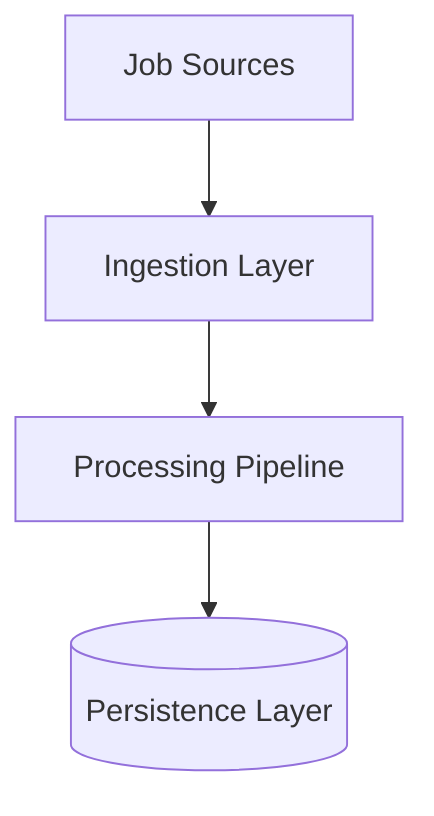
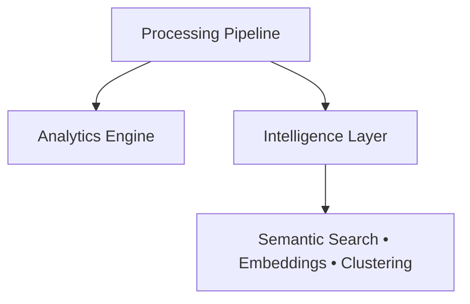

# Building JobPulse AI: Designing an AI-Powered Job Market Intelligence Platform from Scratch

## 1. The Problem
Every day, thousands of software engineering jobs are published across dozens of platforms. While job boards make these listings searchable, they rarely make them understandable. Questions like *Which skills are growing fastest?*, *Which companies hire similar profiles?*, or *What jobs are semantically related to my experience?* remain surprisingly difficult to answer.

JobPulse AI began as an attempt to answer those questions—not by building another scraper, but by designing an extensible intelligence platform capable of transforming raw job postings into structured, searchable, and analyzable knowledge.

## 2. Design Goals
To move beyond a fragile scraper into a scalable data platform, the architecture was designed around several strict engineering constraints:
- **Modular architecture**: Every layer must operate independently.
- **Extensible scraper framework**: Adding new job sources should require zero modifications to the core orchestrator.
- **Clean separation of concerns**: Data extraction, business logic, persistence, and machine learning must never intertwine.
- **Reproducibility**: Experiments, embeddings, and analytics must be perfectly reproducible locally without relying on external cloud APIs.
- **Versioned datasets**: Every domain object must retain strict data lineage.
- **Configuration-driven components**: ML hyperparameters and feature extractors must be defined declaratively, not hardcoded.

### Guiding Principle
*Every component should be replaceable without requiring changes to the rest of the system.* Throughout the project, this principle drove the use of registries, repositories, providers, adapters, and abstract interfaces.

## 3. System Architecture

The platform is built using a strict layered architecture:

- **Ingestion**: Abstracted clients and parsers convert messy DOMs into pure `JobPosting` domain objects.
- **Processing**: A deterministic pipeline cleans, fingerprints (SHA-256), and deduplicates records.
- **Persistence**: The Repository pattern isolates SQLAlchemy and Postgres from the business logic.
- **Intelligence**: Configuration-driven ML models project the data into semantic vector spaces.

## 4. Why This Isn't "Just Another Job Scraper"
The difference between a script and a data platform becomes obvious when looking at the architecture.

| Typical Scraper | JobPulse AI |
| :--- | :--- |
| HTML → CSV | HTML → Domain Model |
| Keyword Search | Semantic Search |
| Flat Scripts | Layered Architecture |
| No Persistence | PostgreSQL + Repository Pattern |
| One-off Notebook | Feature Store + Analytics Engine |
| No ML Infrastructure | Embeddings + FAISS + Experiment Tracking |
| Static Data | Intelligence Platform |

## 5. Architectural Evolution
To ensure deliberate, manageable growth, the project was developed across highly focused iterations:

| Sprint | Major Milestone |
| :--- | :--- |
| **Sprint 1** | Clean Architecture Foundation |
| **Sprint 2** | Extensible Ingestion Framework |
| **Sprint 3** | Processing Pipeline |
| **Sprint 4** | Persistence Layer |
| **Sprint 5** | Analytics & Feature Store |
| **Sprint 6** | Semantic Intelligence |

## 6. Building the Data Platform
The first half of the project focused entirely on deterministic data engineering.

To solve the fragility of web scraping, we introduced a **Registry Pattern**. The `IngestionManager` simply loops over registered sources (e.g., `RemoteOKScraper`), totally oblivious to how HTTP requests or JSON parsing actually work. 

Once ingested, the records pass through a strict `ProcessingPipeline`. The pipeline generates a cryptographic `fingerprint` for every job based on its core attributes, and checks it against an abstracted `DuplicateDetector`.

When it comes time to save the data, we utilize the **Repository Pattern**. We rely on a carefully constructed `ON CONFLICT DO UPDATE` (UPSERT) query in PostgreSQL. Instead of simply ignoring duplicates or blindly overwriting them, the repository selectively updates volatile fields (like `last_seen_at`) while protecting enriched platform fields (like machine learning predictions). 

## 7. From Analytics to Intelligence
Analytics alone can only tell you how many times the word "Python" appeared. It cannot tell you that a "Backend Developer" and a "Django Engineer" are highly related roles.

To bridge this gap, we introduced the **Intelligence Layer**:
- **Semantic Embeddings**: Using local `all-MiniLM-L6-v2` models via `sentence-transformers`, we convert job descriptions into dense 384-dimensional vectors.
- **TextBuilder**: Rather than embedding raw HTML, we construct highly dense strings combining the title, company, location, and skills to maximize semantic value.
- **FAISS & Embedding Cache**: Vectors are cached to disk by model version, and loaded into FAISS for sub-10ms semantic retrieval.
- **Canonical Skill Ontology**: A YAML-driven ontology maps aliases (e.g., "AWS", "amazon web services") to canonical categories, stripping away fragile regex matching in favor of standardized feature vectors.

## 8. Why Local AI?
Rather than relying on hosted embedding services, JobPulse AI uses locally executed sentence-transformer models. This decision keeps the platform reproducible, removes API costs, enables offline experimentation, and ensures contributors can reproduce results without external credentials.

## 9. Engineering Decisions

| Decision | Reason |
| :--- | :--- |
| **Registry Pattern** | New scrapers require no changes to orchestration; open-closed principle. |
| **Repository Pattern** | Business logic remains entirely isolated from SQLAlchemy and PostgreSQL internals. |
| **PyYAML + Pydantic Config** | Strong validation and typed configuration yielding IDE autocomplete and immediate runtime failures. |
| **Sentence Transformers** | Local, reproducible semantic embeddings with zero external API dependencies or costs. |
| **FAISS** | Lightweight, lightning-fast semantic vector retrieval. |
| **Canonical Skill Ontology** | Consistent normalization allowing clean integration between analytics and downstream ML features. |
| **Versioned Embedding Cache** | Eliminates expensive recomputation across pipeline runs while cleanly isolating different models. |
| **Experiment Tracking** | Reproducible ML workflows driven by YAML configurations and outputting versioned CSV/PNG artifacts. |

## 10. Results & Scale
Rather than evaluating the project solely through model accuracy, I measured operational characteristics such as processing throughput, semantic retrieval latency, dimensionality reduction performance, and extensibility. These metrics better reflect the engineering goals of the platform.

| Metric | Value |
| :--- | :--- |
| Jobs Processed (Demo sample) | 100 |
| Embedding Dimension | 384 |
| Semantic Search Latency | ~6.4 ms |
| Processing Time | ~1.98 s |
| UMAP Projection Time | ~0.41 s |
| Feature Extraction Time | ~0.17 s |
| Duplicate Rate | < 3% |

### Technology Stack
| Layer | Technologies |
| :--- | :--- |
| Language | Python 3.13 |
| Data Processing | Pandas, NumPy |
| Persistence | PostgreSQL, SQLAlchemy, Alembic |
| ML | Sentence Transformers, FAISS, scikit-learn, UMAP |
| Configuration | PyYAML, Pydantic |
| Testing | pytest |
| CI/CD | GitHub Actions |
| Export | Parquet, CSV, JSON |

### Project Snapshot
- 6 engineering sprints
- 40+ Python modules
- Layered Clean Architecture
- Semantic Search
- Feature Store
- Analytics Engine
- Experiment Tracking
- Versioned Embedding Cache
- PostgreSQL Persistence
- GitHub Actions CI/CD

## 11. Lessons Learned
- **The Value of Clean Abstractions**: The most valuable lesson wasn't related to machine learning—it was realizing that investing in clean abstractions early dramatically accelerated later development. Once registries, repositories, and provider interfaces were in place, adding semantic search and embedding analytics required surprisingly little modification to the existing codebase.
- **Decoupling Reducers**: Initially, coupling visualization tools to specific algorithms seemed faster. However, abstracting the `Reducer(ABC)` interface paid dividends immediately, allowing PCA to be used as a fast, deterministic baseline, and UMAP to be used for complex semantic manifolds.
- **Deterministic Pipelines**: Building a strict, state-free processing pipeline made debugging deduplication incredibly simple. 

## 12. What's Next
JobPulse AI was designed to scale. With the semantic foundation established, the immediate roadmap includes:
- **Semantic Clustering**: Utilizing HDBSCAN/K-Means over the reduced UMAP embeddings to automatically discover job market segments.
- **Salary Prediction**: Regressing salary bands against the semantic vectors and structured feature vectors.
- **Recommendation Engine**: Building a career transition suggestion engine based on overlapping skill vectors.
- **API & Dashboard**: Exposing the platform via FastAPI to serve real-time analytics.

## 13. Conclusion
JobPulse AI demonstrates that meaningful AI systems are built on much more than machine learning models. Reliable ingestion, deterministic processing, reproducible experiments, and well-defined architectural boundaries are what enable intelligent capabilities to scale over time. Future work will continue to expand the platform into clustering, recommendation, forecasting, and interactive analytics while preserving the same modular design principles established from the beginning.
