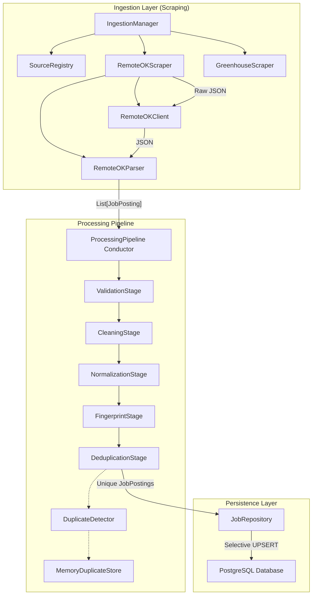

# System Component Diagram

```mermaid
graph TD
    %% Define components
    subgraph Ingestion["Ingestion Layer (Scraping)"]
        A[IngestionManager] --> B[SourceRegistry]
        A --> C[RemoteOKScraper]
        A --> D[GreenhouseScraper]
        
        C --> E[RemoteOKClient]
        C --> F[RemoteOKParser]
    end

    subgraph Processing["Processing Pipeline"]
        G[ProcessingPipeline Conductor]
        H[ValidationStage]
        I[CleaningStage]
        J[NormalizationStage]
        K[FingerprintStage]
        L[DeduplicationStage]
        
        G --> H --> I --> J --> K --> L
        
        M[DuplicateDetector]
        N[MemoryDuplicateStore]
        L -.-> M -.-> N
    end

    subgraph Persistence["Persistence Layer"]
        O[JobRepository]
        P[PostgreSQL Database]
        
        O -->|Selective UPSERT| P
    end

    %% Flow
    C -- "Raw JSON" --> E
    E -- "JSON" --> F
    F -- "List[JobPosting]" --> G
    L -- "Unique JobPostings" --> O
```
