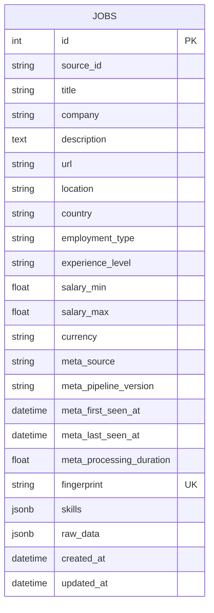

# Database Entity Relationship Diagram

```mermaid
erDiagram
    JOBS {
        int id PK
        string source_id
        string title
        string company
        text description
        string url
        string location
        string country
        string employment_type
        string experience_level
        float salary_min
        float salary_max
        string currency
        
        string meta_source
        string meta_pipeline_version
        datetime meta_first_seen_at
        datetime meta_last_seen_at
        float meta_processing_duration
        
        string fingerprint UK
        jsonb skills
        jsonb raw_data
        
        datetime created_at
        datetime updated_at
    }
```
