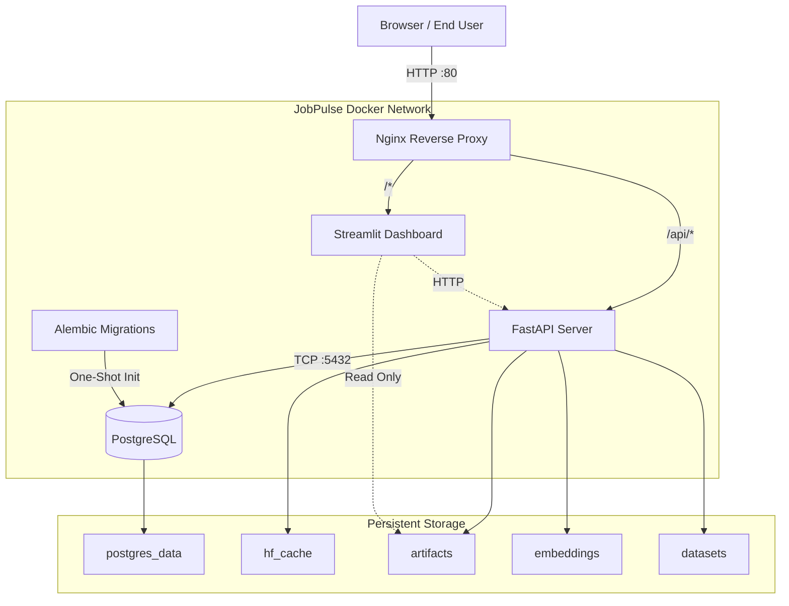

# Deployment Architecture

JobPulse AI uses a fully containerized architecture orchestrated by Docker Compose. This ensures reproducibility, scalability, and strict separation between the API backend and the Streamlit frontend.

## Operational Diagram

## Infrastructure Components

1. **Nginx**: Acts as the sole ingress controller. Handles security headers, body size limits, and routes traffic deterministically to avoid exposing internal service ports to the host machine.
2. **Migration Worker**: An ephemeral container that runs Alembic migrations against PostgreSQL before the API container is permitted to start.
3. **API**: The multi-stage built FastAPI server processing intelligence requests.
4. **Dashboard**: The Streamlit reference client mapping user interactions to API HTTP calls.

## Configuration Profiles
The deployment uses multiple `docker-compose` topologies depending on the environment:
- **Development** (`docker-compose.yml` + `docker-compose.dev.yml`): Enables hot-reloading by bind-mounting source code directly into containers.
- **Production** (`docker-compose.yml` + `docker-compose.prod.yml`): Enforces immutable images and strict CPU/Memory resource constraints.
