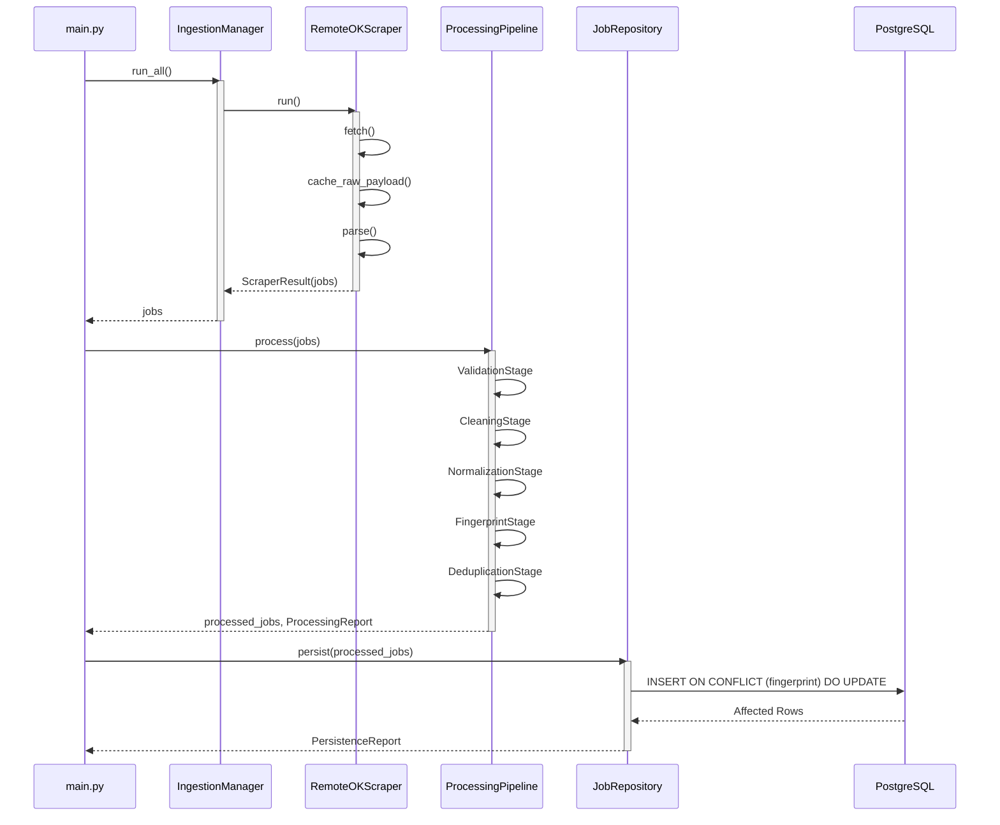

# Data Ingestion & Persistence Sequence

```mermaid
sequenceDiagram
    participant CLI as main.py
    participant IM as IngestionManager
    participant Scraper as RemoteOKScraper
    participant Pipeline as ProcessingPipeline
    participant Repo as JobRepository
    participant DB as PostgreSQL

    CLI->>IM: run_all()
    activate IM
    IM->>Scraper: run()
    activate Scraper
    Scraper->>Scraper: fetch()
    Scraper->>Scraper: cache_raw_payload()
    Scraper->>Scraper: parse()
    Scraper-->>IM: ScraperResult(jobs)
    deactivate Scraper
    IM-->>CLI: jobs
    deactivate IM

    CLI->>Pipeline: process(jobs)
    activate Pipeline
    Pipeline->>Pipeline: ValidationStage
    Pipeline->>Pipeline: CleaningStage
    Pipeline->>Pipeline: NormalizationStage
    Pipeline->>Pipeline: FingerprintStage
    Pipeline->>Pipeline: DeduplicationStage
    Pipeline-->>CLI: processed_jobs, ProcessingReport
    deactivate Pipeline

    CLI->>Repo: persist(processed_jobs)
    activate Repo
    Repo->>DB: INSERT ON CONFLICT (fingerprint) DO UPDATE
    DB-->>Repo: Affected Rows
    Repo-->>CLI: PersistenceReport
    deactivate Repo
```
